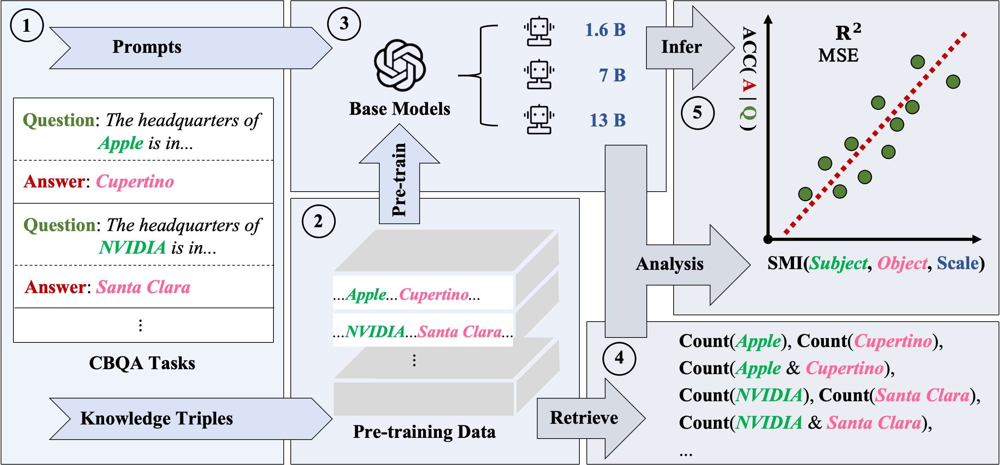

<div align="center">
    <h2> Predicting Large Language Model Capabilities on Closed-Book QA Tasks Using Only Information Available Prior to Training </h2>

<p align="center">
  <!-- <a href="https://huggingface.co">Arxiv Paper</a> • -->
  <a href="https://github.com/yuhui1038/SMI">Github</a> •
  <!-- <a href="https://huggingface.co">Huggingface</a> • -->
  <!-- <a href="#-citation">Citation</a> -->
</p>
</div>





## 🗒️ Pre-training Data

Coming soon!


## 🕸️ Model

Coming soon!

<!-- 
## 📊 Evaluation Set

Coming soon!
``` -->


<!-- ## 📖 Citation

If you find our code or paper helps, please consider citing:

```bibtex
@article{jiang2024motiongpt,
  title={Motiongpt: Human motion as a foreign language},
  author={Jiang, Biao and Chen, Xin and Liu, Wen and Yu, Jingyi and Yu, Gang and Chen, Tao},
  journal={Advances in Neural Information Processing Systems},
  volume={36},
  year={2024}
}

@inproceedings{chen2023executing,
  title={Executing your Commands via Motion Diffusion in Latent Space},
  author={Chen, Xin and Jiang, Biao and Liu, Wen and Huang, Zilong and Fu, Bin and Chen, Tao and Yu, Gang},
  booktitle={Proceedings of the IEEE/CVF Conference on Computer Vision and Pattern Recognition},
  pages={18000--18010},
  year={2023}
}
``` -->

