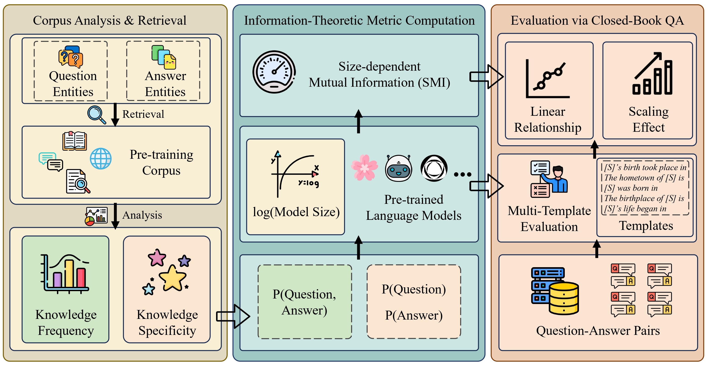

<h2 align="center">Beyond Scaling: Measuring and Predicting the Upper Bound of Knowledge Retention in Language Model Pre-Training</h2>

<p align="center">
  <a href="https://arxiv.org/abs/2502.04066"></a>
  <a href="https://aclanthology.org/"></a>
  <a href="https://huggingface.co/EleutherAI/pythia-12b"></a>
</p>

> **Note:** For the Chinese version of this README, please refer to [README_zh.md](README_zh.md).

<p align="center">
  
</p>

## 🔔 News

- 🏆 **[2026-04]** Our paper has been accepted at **ACL 2026 Main**.
- 🎉 **[2025-02]** Our paper is released on arXiv: [arXiv:2502.04066](https://arxiv.org/abs/2502.04066).

## 📚 Overview

How much factual knowledge can a language model actually **retain** from its pre-training corpus, and is this upper bound predictable **before** training? This work studies the relationship between **pre-training co-occurrence statistics** (subject–object frequency in the corpus) and **downstream factual recall** of language models, and proposes a measure that predicts the **upper bound of knowledge retention** beyond what raw scaling laws suggest.

We instantiate the analysis on the **Pythia** model suite and three large-scale pre-training corpora — **The Pile**, **ROOTS**, and **SlimPajama** — using a ParaRel-style probing benchmark over 15 relation classes with paraphrased templates.

### ✨ Highlights

- 🔍 **Corpus-side measurement** — efficient frequency search of subject–object co-occurrences across The Pile, ROOTS, and SlimPajama
- 🧪 **Model-side probing** — knowledge retention probes for the full **Pythia** model family using paraphrased templates over 15 relation classes
- 📈 **Predictive analysis** — quantitative link between pre-training co-occurrence and the *upper bound* of factual recall, beyond scaling-law trends
- 🛠️ **End-to-end pipeline** — corpus download · frequency search · vLLM/Transformers inference · figure & table reproduction

## 📂 Project Structure

```
SMI/
├── assets/                       # 🖼️ Paper figures (intro.jpg, etc.)
├── download_tools/               # ⬇️ Pre-training corpus & model downloaders
│   ├── pile/                     #     The Pile downloader
│   ├── roots/                    #     ROOTS downloader
│   ├── download_huggingface_model.py
│   └── baseline.xlsx
├── search/                       # 🔍 Co-occurrence frequency search
│   ├── pararel_15classes.json    #     ParaRel-style probe set (15 relation classes)
│   ├── pile/                     #     Search over The Pile
│   ├── roots/                    #     Search over ROOTS
│   ├── slimpajama/               #     Search over SlimPajama
│   ├── ours/                     #     Our merged / processed search results
│   └── tools/                    #     Search utilities
├── infer/                        # 🤖 Model probing / inference
│   ├── infer_vllm.py             #     vLLM-based fast inference
│   ├── infer_transformers.py     #     HuggingFace Transformers inference
│   ├── multi_templates.json      #     Paraphrased prompt templates per relation
│   ├── infer.sh                  #     Batch inference launcher
│   ├── install.sh                #     Environment setup
│   └── merge_outputs/            #     Inference output aggregation
├── analysis/                     # 📊 Result analysis
│   ├── main_figures/             #     Code for main paper figures
│   ├── main_tables/              #     Code for main paper tables
│   ├── tables/                   #     Auxiliary tables
│   └── tools/                    #     Analysis utilities
├── pictures/                     # 🎨 Figure-rendering scripts (matplotlib)
│   ├── cooccur_frequency.py / .pdf
│   ├── pythia_acc.py / .pdf
│   ├── eval_data.py / .pdf
│   └── colors.py
└── tables/                       # 📑 Dataset / evaluation metadata
    ├── data_info.py
    └── data_info{,_raw}.xlsx
```

## 🛠️ Usage Guide

### 1. Environment Setup

```bash
cd infer
bash install.sh
```

This installs `vllm`, `transformers`, and other inference dependencies.

### 2. Download Pre-training Corpora & Models

The Pile / ROOTS downloaders live under `download_tools/`:

```bash
# Example: download The Pile shards
cd download_tools/pile && bash <download_script>

# Example: download a Pythia checkpoint from Hugging Face
python download_tools/download_huggingface_model.py \
    --repo EleutherAI/pythia-12b \
    --out  /path/to/models/pythia-12b
```

> ⚠️ Both corpora are large (TB-scale). Make sure to allocate enough disk and bandwidth.

### 3. Co-occurrence Frequency Search

We measure how often each `(subject, object)` pair from the probe set co-occurs in each pre-training corpus. Run the corresponding searcher under `search/`:

```bash
# Pile / ROOTS / SlimPajama each have their own search pipeline
cd search/pile      && bash <search_script>
cd search/roots     && bash <search_script>
cd search/slimpajama && bash <search_script>
```

Results are merged under `search/ours/` for downstream analysis.

### 4. Model Probing (vLLM / Transformers)

```bash
# Recommended: vLLM for high-throughput probing
python infer/infer_vllm.py \
    --model /path/to/pythia-XX \
    --prompts infer/multi_templates.json \
    --probe   search/pararel_15classes.json \
    --out     infer/merge_outputs/pythia-XX.jsonl

# Or use HuggingFace Transformers
python infer/infer_transformers.py --model /path/to/pythia-XX ...
```

Each fact is queried with **multiple paraphrased templates** (`multi_templates.json`) to reduce template sensitivity. See `infer/infer.sh` for batch launching.

### 5. Reproducing Figures & Tables

Once inference outputs and corpus-search results are available:

```bash
# Main figures (e.g., scaling vs. retention upper bound)
python analysis/main_figures/<figure_name>.py

# Main tables
python analysis/main_tables/<table_name>.py

# Standalone matplotlib figures (Pythia acc, co-occurrence freq, ...)
python pictures/pythia_acc.py
python pictures/cooccur_frequency.py
python pictures/eval_data.py
```

## 📝 Citation

If you find this work useful, please cite our paper:

```bibtex
@inproceedings{jiang-zhang-2026-beyondscaling,
    title     = "Beyond Scaling: Measuring and Predicting the Upper Bound of Knowledge Retention in Language Model Pre-Training",
    author    = "Jiang, Changhao and Zhang, Ming and Cao, Yifei and Ye, Junjie and
                 Fan, Xiaoran and Dou, Shihan and Xi, Zhiheng and Sun, Jiajun and
                 Dong, Yi and Shen, Yujiong and Tong, Jingqi and Fan, Baoyu and
                 Gui, Tao and Zhang, Qi and Huang, Xuanjing",
    booktitle = "Proceedings of the 64th Annual Meeting of the Association for Computational Linguistics",
    year      = "2026",
    publisher = "Association for Computational Linguistics",
    url       = "https://arxiv.org/abs/2502.04066"
}
```

## 🔗 Related Projects

| Project | Description | Link |
|---------|-------------|------|
| **Pythia** | Open-source LM suite used for our probing experiments | [GitHub](https://github.com/EleutherAI/pythia) |
| **ParaRel** | Paraphrased relation probing set | [GitHub](https://github.com/yanaiela/pararel) |
| **LLMEval-Fair** (ACL 2026) | Robust & fair evaluation of LLMs | [GitHub](https://github.com/llmeval/LLMEval-Fair) |

## 📞 Contact Us

For questions or collaboration, please:

- Open an [Issue](https://github.com/yuhui1038/SMI/issues) on GitHub
- Contact the project maintainers:
  - **Changhao Jiang**: chjiang24@m.fudan.edu.cn
  - **Ming Zhang**: mingzhang23@m.fudan.edu.cn

---

<p align="center">
  <b>Beyond Scaling</b> | Fudan NLP Lab
</p>
